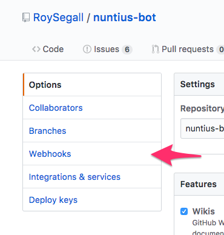
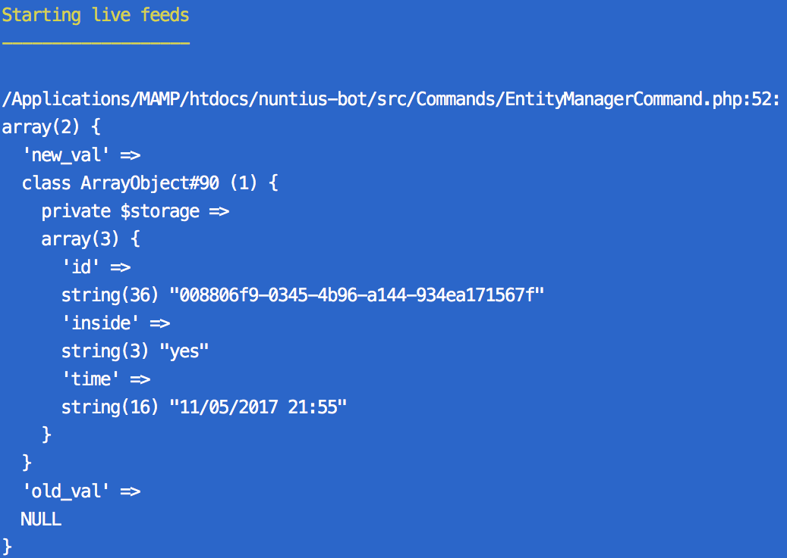

Setting up the configuration is pretty much easy. Go to the repository settings:


And now go to the webhooks page:


Add a new Webhook:


You can set up in the next way:


GitHub will send a request to do a sanity check. Just to make sure the address
exists.

## Testing
If you want to test the integration you'll right you need that your local host
will be acessable. The most easy way to do that is with [ngrok](https://ngrok.com/).
`ngrok` open your localhost with a temporary address. In my case the address
will look like `http://66a4cc4d.ngrok.io/nuntius-bot/github`.

If you want to make sure that something happens you can log it to the logger 
entity:

```php
Nuntius::getEntityManager()->get('logger')->insert(['foo' => 'bar']);
```

And then, to make sure something is going in the DB you can use the built in 
live entity view option:

```bash
php console.php nuntius:entity logger live_view
```

This will output the next result in the terminal:

