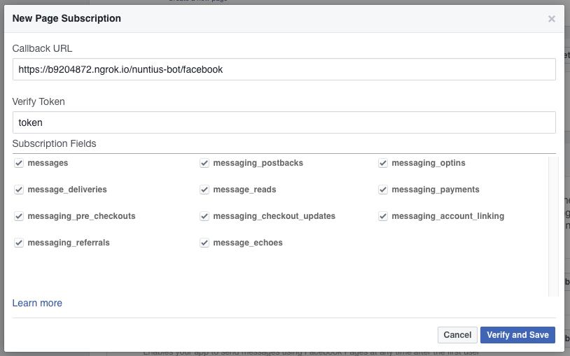
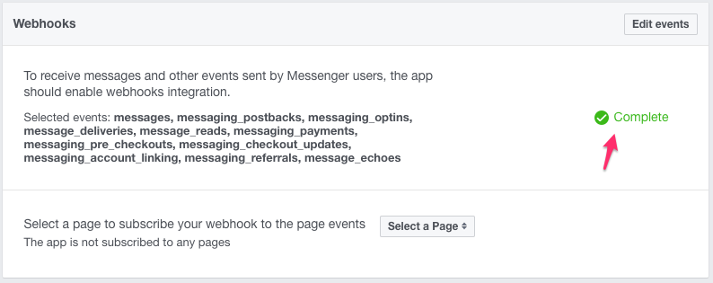
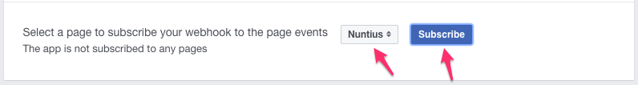

Before starting to set up the integration make sure you have a page on Facebook.

We will begin by setting up a Facebook application. Go to 
[Facebook developers](https://developers.facebook.com/) site:

After setting up the app we will add a Messenger product set up:

The next ste is to generate a token for the page:

Save the token in your `credentials.local.yml` in `fb_token` key.

Now, let set up the address which Facebook will interact with Nuntius. Click on
`Setup Webhooks`:

After that a modal will open for you:

Couple of things:

* The address is the address of the facebook webhook handler - 
`https://b9204872.ngrok.io/nuntius-bot/facebook`
* The token is not mandatory, it can be anything.
* Under `Subscription Fields` check all the boxes.

You'll get this if anything is OK:

Now, we need to set up the page as a subscriber to the events we selected:

Please note that for now, when this doc been written, you can't change the 
address of the webhook.
