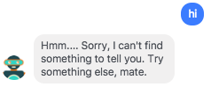
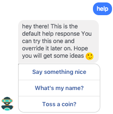

You set up as you saw in 
[Configure the integration](Webhooks/Facebook/Configure_the_integration.html).

If you'll write something like `Hey` or `Hello` you'll get something like that:



But if you'll write `help` you'll get something like that:



You wou'ld probably want to override that. It's very easy, just override the 
class by update your `hooks.local.yml`:
```yaml
webhooks_routing:
  'facebook': '\tests\overrides\NuntiusFacebookOverride'
```

## What's the API?

The 