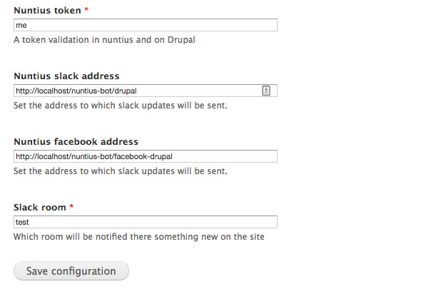

We will begin by download the [Nuntius Drupal integration](https://github.com/RoySegall/nuntius-drupal-integration)
and enable it.

Now, under `admin/config/system/nuntius` we will set the settings in the next 
form:

Let's go over the settings:
* Nuntius token - this is a token that the webhooks will validate.
* Nuntius slack address - Drupal will send information to this end point. 
Nuntius already contains them so you don't need to set any thing.
* Nuntius facebook address - Same as the above but oriented for Facebook 
Messenger.
* Slack room - To which slack room the message about new content will be 
published.

_Don't forget to add Nuntius user as a member of that room_
